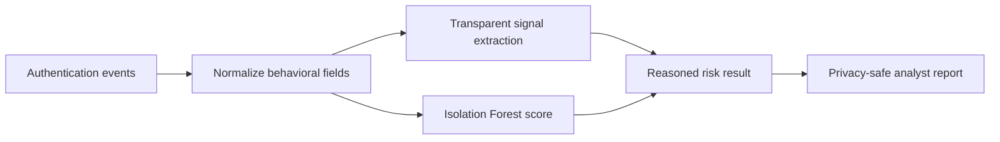

# Identity Compromise Detector: Explainable Behavioral Risk

[](https://github.com/niketkrishnan/identity-compromise-detector/actions/workflows/ci.yml)

A privacy-conscious identity analytics experiment that combines transparent behavioral signals with an Isolation Forest anomaly score. It highlights suspicious combinations such as a new device, new ASN, new country, unusual access hour, failed authentication, and privileged identity—then gives an analyst the reasons instead of only a number.

## Synthetic takeover walkthrough

The local fixture contains **8 events** and produces **3 medium-or-higher alerts**. The strongest example is `u-bob` at score `0.62`, with these reasons:

```text
failed authentication
new device for user
new network ASN for user
new country for user
unusual access hour
privileged identity
```

The report is generated at [`artifacts/identity_results.json`](artifacts/identity_results.json). Identifiers are synthetic and the results are not a production benchmark.

## Run the detector

```bash
python -m pip install -e '.[dev]'
python evaluate.py
pytest
```

Read [`src/identity_detector.py`](src/identity_detector.py) with [`tests/test_identity_detector.py`](tests/test_identity_detector.py). The privacy-safe report projection avoids exporting raw identifiers, and the detector recommends analyst review rather than locking an account or revoking a token.

## Signal pipeline



## Privacy and fairness are part of the model contract

A new country or network ASN is not proof of compromise. VPNs, travel, shared devices, mobile networks, sparse histories, and legitimate privilege changes can all create false positives. Any future benchmark must document cohort definitions, identifier minimization, dataset terms, and false positives by relevant cohort before a performance claim is made.

## Other defensive systems

- [Explainable AI SOC Detection](https://github.com/niketkrishnan/explainable-ai-soc) — hybrid detection with ATT&CK evidence.
- [LLM Firewall and RAG Security Lab](https://github.com/niketkrishnan/llm-firewall-rag-security-lab) — prompt and tool trust boundaries.
- [Cloud Attack-Path Prioritizer](https://github.com/niketkrishnan/cloud-attack-path-prioritizer) — exposure paths to sensitive assets.
- [SBOM Supply-Chain Intelligence](https://github.com/niketkrishnan/sbom-supply-chain-intelligence) — dependency policy context.
- [Portfolio site](https://github.com/niketkrishnan/HTML-Website) — resume-aligned project map.

For security concerns, use a private GitHub Security Advisory or contact [@niketkrishnan](https://github.com/niketkrishnan). Do not publish real identity events, tokens, or user identifiers.
