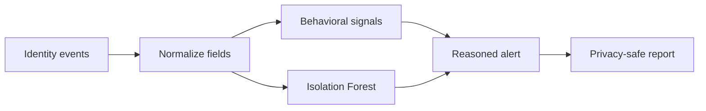

# Behavioral analytics flow

```mermaid
flowchart LR
    A[Identity events] --> B[Normalize fields]
    B --> C[Behavioral signals]
    B --> D[Isolation Forest]
    C --> E[Reasoned alert]
    D --> E
    E --> F[Privacy-safe report]
```

The report projection intentionally leaves raw identifiers out of analyst-facing exports and does not perform account actions.
